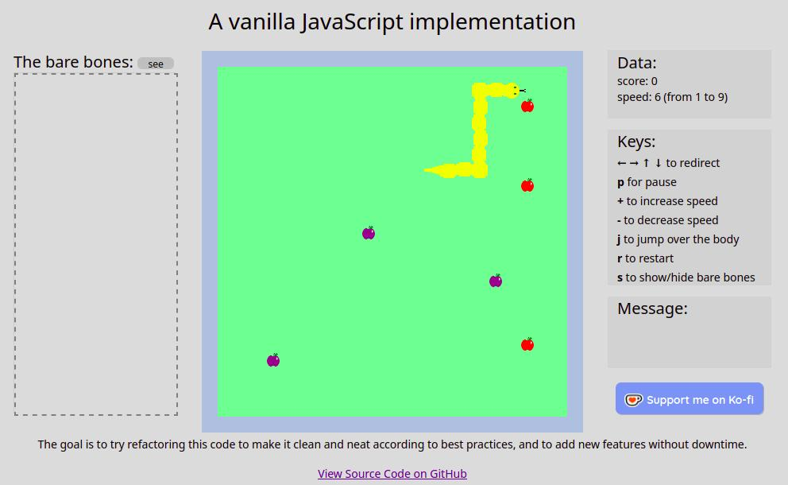

# Refactoring Vanilla JavaScript Implementation

> [!NOTE]
> **Important Notice:**
> Not to be copied. 
> Not to be cloned. Not production ready code.
> No warranties are made regarding the quality of the process or the final result.

> [!NOTE]
> **Disclaimer:** This is only for portfolio showcasing. The goal is to try refactoring this code to make it clean and neat according to best practices, and to add new features without any downtime.
This is a special challenge since I am a Java backend developer. I hope to learn through this process.
I am not making any warranties on the quality of the process neither the final result.
The first commits are expected to include bad practices and technical debt.

## Table of Contents
- [Brief description](#brief-description)
- [Link to running implementation](#link-to-running-implementation)
- [Support](#support)

## Brief description:

This is a vanilla javaScript implementation of the classic game. Also inlcuding speed changing, pausing, poisonous fruits, and the hability to jump over the body in some scenarios. The inner state representation can also be seen in 'The bare bones' section.

## Link to running implementation

[Check it running in Github pages](https://mauro-franzoy.github.io/refactoring-vanilla-javascript-implementation/)

## Support
